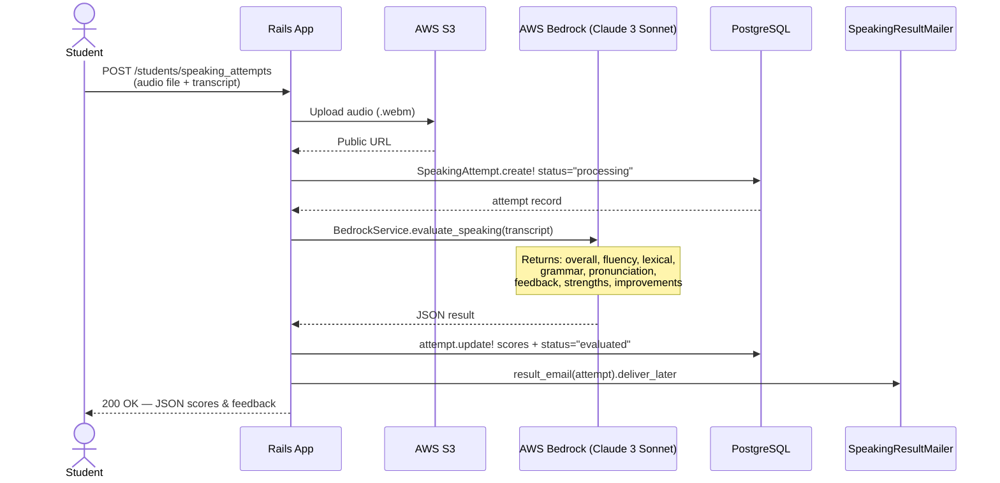
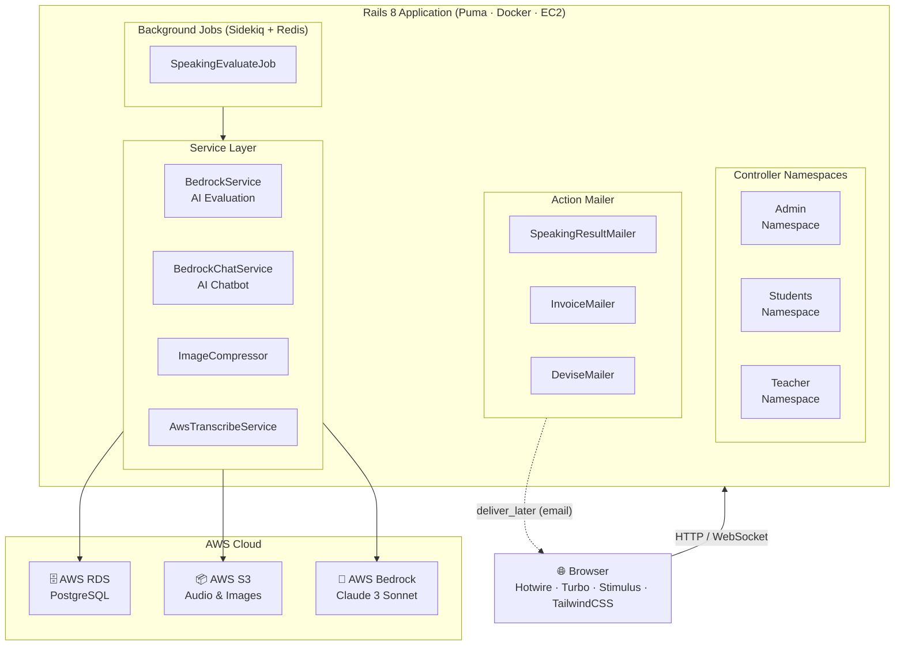
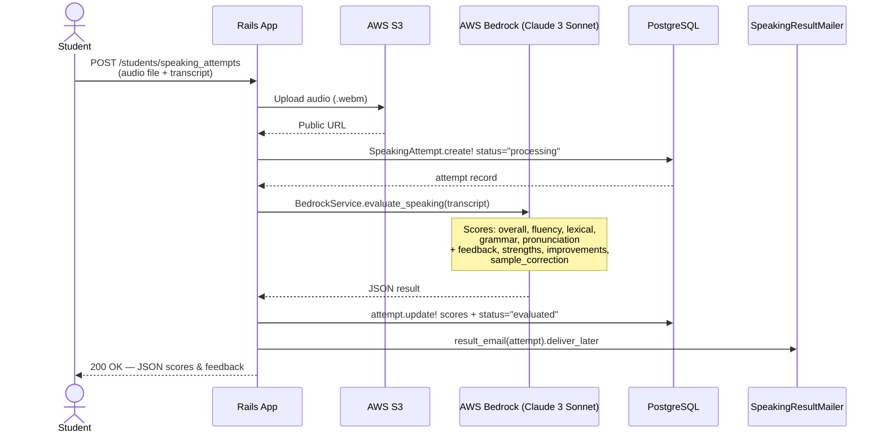
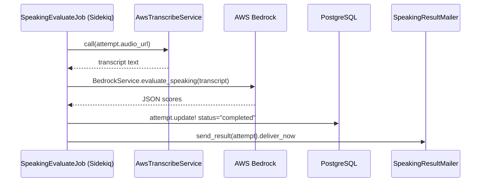
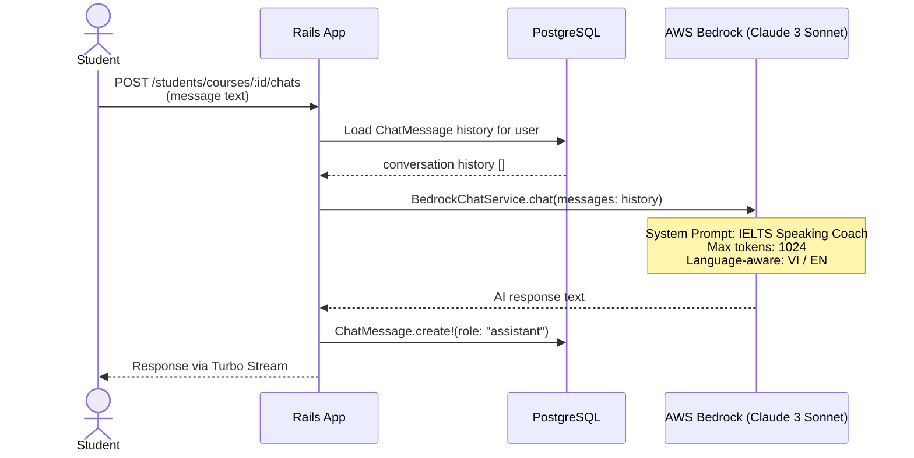
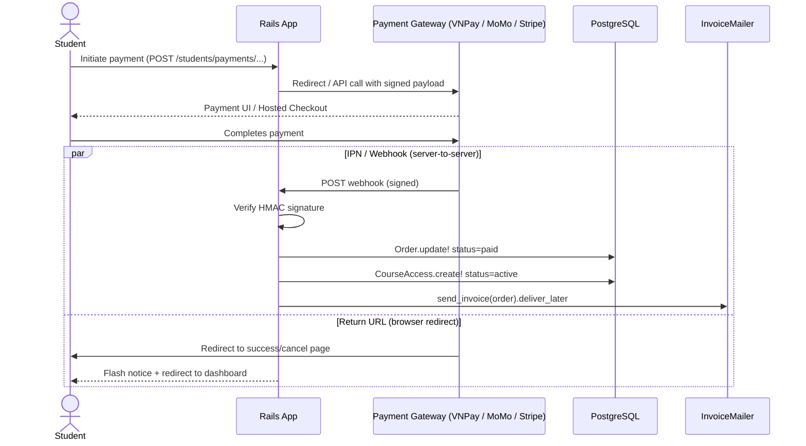
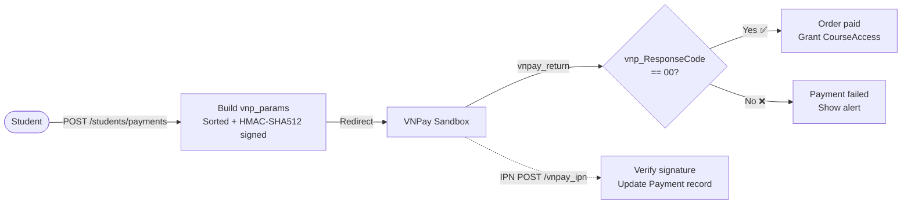
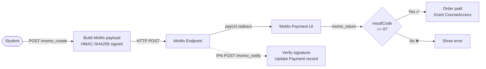
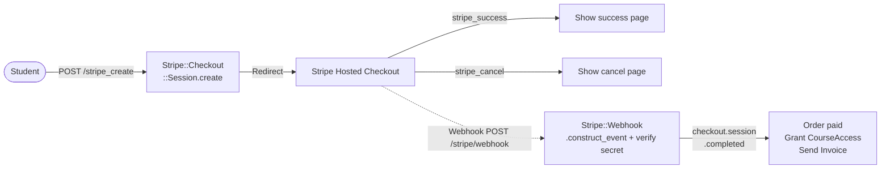

# 🎓 IELTS Learning Platform — Documentation

> A full-stack web application for IELTS Speaking preparation, built with **Ruby on Rails 8**. Students can enroll in courses, practice speaking with AI evaluation, and track their progress. Admins manage content, users, and payments.

---

## Table of Contents

1. [Features](#features)
2. [Tech Stack](#tech-stack)
3. [Getting Started](#getting-started)
4. [Project Structure](#project-structure)
5. [User Roles](#user-roles)
6. [Routing & API](#routing--api)
   - [Authentication](#authentication)
   - [Student Endpoints](#student-endpoints)
   - [Admin Endpoints](#admin-endpoints)
   - [Webhook Security](#webhook-security)
7. [Technical Architecture](#technical-architecture)
   - [System Architecture](#system-architecture-diagram)
   - [Database Schema & ERD](#database-schema)
   - [AI Speaking Evaluation Pipeline](#ai-speaking-evaluation-pipeline)
   - [AI Chatbot Architecture](#ai-chatbot-architecture)
   - [Payment Gateway Integration](#payment-gateway-integration)
   - [File Storage](#file-storage)
   - [Background Jobs](#background-job-infrastructure)
   - [Deployment](#deployment)
   - [Security](#security-considerations)

---

## Features

- **Course Management** — structured courses with sections and lessons, published/draft states
- **Speaking Practice** — record audio, get AI-scored feedback (Fluency, Lexical, Grammar, Pronunciation)
- **AI Chatbot** — IELTS coach powered by Claude 3 Sonnet via AWS Bedrock
- **Multi-gateway Payments** — VNPay, MoMo, and Stripe with webhook support
- **Role-based Access** — Admin and Student with scoped namespaces
- **Email Notifications** — speaking results, invoices, account confirmation via Action Mailer
- **Achievement Tracking** — students can log IELTS scores and milestones

---

## Tech Stack

| Layer | Technology |
|---|---|
| Framework | Ruby on Rails 8.0 |
| Language | Ruby 3.3.5 |
| Database | AWS RDS (PostgreSQL) |
| Background Jobs | Sidekiq |
| AI Evaluation | AWS Bedrock (Claude 3 Sonnet) |
| File Storage | AWS S3 + Active Storage |
| Auth | Devise |
| Frontend | Hotwire (Turbo + Stimulus), TailwindCSS |
| Deployment | Docker + EC2 |
| Testing | RSpec, FactoryBot, Capybara |

---

## Getting Started

### Prerequisites

- Ruby 3.3.5
- Redis (for Sidekiq)
- AWS account (EC2 + RDS + S3 + Bedrock)

### Installation

```bash
# Clone the repository
git clone <repo-url>
cd IELTS_LEARNING_PLATFORM

# Install dependencies
bundle install

# Setup environment variables
cp .env.example .env
# Edit .env with your credentials

# Setup database
rails db:create db:migrate db:seed

# Start the server
bin/dev
```

### Environment Variables

```env
# AWS
AWS_REGION=ap-southeast-1
AWS_ACCESS_KEY_ID=your_key
AWS_SECRET_ACCESS_KEY=your_secret
AWS_BUCKET=your_s3_bucket

# Stripe
STRIPE_SECRET_KEY=sk_test_...
STRIPE_WEBHOOK_SECRET=whsec_...

# VNPay
VNPAY_TMN_CODE=your_code
VNPAY_HASH_SECRET=your_secret

# MoMo
MOMO_ACCESS_KEY=your_key
MOMO_SECRET_KEY=your_secret
```

---

## Project Structure

```
app/
├── controllers/
│   ├── admin/          # Admin panel controllers
│   ├── students/       # Student-facing controllers
│   ├── teacher/        # Teacher dashboard
│   └── users/          # Devise overrides
├── models/             # ActiveRecord models
├── services/
│   ├── bedrock_service.rb        # AI speaking evaluation
│   └── bedrock_chat_service.rb   # AI chatbot
├── jobs/
│   └── speaking_evaluate_job.rb  # Async AI evaluation
├── mailers/            # Email notifications
└── views/              # ERB templates
```

---

## User Roles

| Role | Access |
|---|---|
| `admin` | Full platform management (users, courses, payments, analytics) |
| `student` | Enroll in courses, practice speaking, view progress |

---

## Routing & API

Base URL: `/` — all routes are server-rendered except the Speaking Attempts endpoint (JSON API).

Authentication is handled via Devise session cookies. Most endpoints require a logged-in user (`authenticate_user!`).

---

### Authentication

Managed by Devise, mounted under `/users`.

| Method | Path | Description |
|---|---|---|
| `GET` | `/users/sign_in` | Login page |
| `POST` | `/users/sign_in` | Authenticate user |
| `DELETE` | `/users/sign_out` | Logout |
| `GET` | `/users/sign_up` | Registration page |
| `POST` | `/users/sign_up` | Create account |
| `GET` | `/users/password/new` | Forgot password |
| `PUT` | `/users/password` | Reset password |

---

### Student Endpoints

All routes prefixed with `/students`. Requires `student` role.

#### Dashboard

| Method | Path | Description |
|---|---|---|
| `GET` | `/students/dashboard` | Student home dashboard |

#### Profile

| Method | Path | Description |
|---|---|---|
| `GET` | `/students/profile/edit` | Edit profile form |
| `PATCH` | `/students/profile` | Update profile |

#### Courses

| Method | Path | Description |
|---|---|---|
| `GET` | `/students/courses` | Browse all published courses |
| `GET` | `/students/courses/progress` | View enrolled courses progress |
| `GET` | `/students/courses/:id` | Course landing page |
| `GET` | `/students/courses/:id/learn` | Course learning view |
| `GET` | `/students/courses/:id/dashboard` | Per-course dashboard |

#### Orders

| Method | Path | Description |
|---|---|---|
| `GET` | `/students/courses/:course_id/orders/new` | New order form |
| `POST` | `/students/courses/:course_id/orders` | Create order |
| `GET` | `/students/courses/:course_id/orders/:id` | Order detail |
| `GET` | `/students/courses/:course_id/orders/:id/checkout` | Checkout page |

#### Payments

| Method | Path | Description |
|---|---|---|
| `POST` | `/students/payments` | Initiate VNPay payment |
| `GET` | `/students/payments/vnpay_return` | VNPay callback (return URL) |
| `GET/POST` | `/students/payments/vnpay_ipn` | VNPay IPN webhook |
| `POST` | `/students/payments/momo_create` | Initiate MoMo payment |
| `POST` | `/students/payments/momo_notify` | MoMo IPN webhook |
| `GET` | `/students/payments/momo_return` | MoMo return URL |
| `POST` | `/students/payments/stripe_create` | Initiate Stripe payment |
| `GET` | `/students/payments/stripe_success` | Stripe success redirect |
| `GET` | `/students/payments/stripe_cancel` | Stripe cancel redirect |
| `POST` | `/stripe/webhook` | Stripe webhook (global) |

#### Speaking Attempts *(JSON API)*

> This is the only endpoint that returns JSON. Used by the frontend speaking recorder.

**`POST /students/speaking_attempts`**

Submit an audio recording for AI evaluation.

- **Authentication:** Required (session cookie)
- **Content-Type:** `multipart/form-data`

**Request Parameters:**

| Field | Type | Required | Description |
|---|---|---|---|
| `audio` | File | ✅ | Audio file (.webm) |
| `course_id` | Integer | ✅ | ID of the course |
| `speaking_topic_id` | Integer | ✅ | ID of the speaking topic |
| `part` | Integer | ✅ | IELTS part number (1, 2, or 3) |
| `transcript` | String | ✅ | Text transcript of the speech |

**Success Response** `200 OK`:

```json
{
  "overall": 6.5,
  "fluency": 6.5,
  "lexical": 7.0,
  "grammar": 6.0,
  "pronunciation": 6.5,
  "feedback": "You demonstrated good vocabulary range with some natural phrases. Work on reducing hesitations and using more complex grammatical structures.",
  "strengths": [
    "Good use of idiomatic expressions",
    "Clear and intelligible pronunciation"
  ],
  "improvements": [
    "Reduce filler words like 'um' and 'uh'",
    "Use more complex sentence structures"
  ],
  "sample_correction": "Instead of 'I am going to the shop every day', say 'I tend to visit the shop on a daily basis'."
}
```

**Error Response** `422 Unprocessable Entity`:

```json
{
  "error": "Audio file is required"
}
```

**Request Flow:**



#### Chat (AI Chatbot)

| Method | Path | Description |
|---|---|---|
| `POST` | `/students/courses/:course_id/chats` | Send a chat message to AI coach |
| `GET` | `/students/courses/:course_id/chats/history` | Retrieve chat history |

---

### Admin Endpoints

All routes prefixed with `/admin`. Requires `admin` role.

#### Dashboard & Analytics

| Method | Path | Description |
|---|---|---|
| `GET` | `/admin` | Admin dashboard |
| `GET` | `/admin/dashboard` | Dashboard index |

#### User Management

| Method | Path | Description |
|---|---|---|
| `GET` | `/admin/users` | List all users |
| `POST` | `/admin/users` | Create user |
| `GET` | `/admin/users/:id/edit` | Edit user form |
| `PATCH` | `/admin/users/:id` | Update user |
| `DELETE` | `/admin/users/:id` | Delete user |

#### Student Management

| Method | Path | Description |
|---|---|---|
| `GET` | `/admin/students` | List students |
| `GET` | `/admin/students/:id` | Student detail |
| `PATCH` | `/admin/students/:id` | Update student |
| `DELETE` | `/admin/students/:id` | Remove student |

#### Teacher Management

| Method | Path | Description |
|---|---|---|
| `GET` | `/admin/teachers` | List teachers |
| `POST` | `/admin/teachers` | Create teacher |
| `GET` | `/admin/teachers/:id/teacher_profile/edit` | Edit teacher profile |
| `PATCH` | `/admin/teachers/:id/teacher_profile` | Update teacher profile |

#### Course Management

| Method | Path | Description |
|---|---|---|
| `GET` | `/admin/courses` | List courses |
| `POST` | `/admin/courses` | Create course |
| `GET` | `/admin/courses/:id` | Course detail |
| `PATCH` | `/admin/courses/:id` | Update course |
| `DELETE` | `/admin/courses/:id` | Delete course |

#### Course Sections & Lessons

| Method | Path | Description |
|---|---|---|
| `GET` | `/admin/courses/:course_id/course_sections` | List sections |
| `POST` | `/admin/courses/:course_id/course_sections` | Create section |
| `PATCH` | `/admin/courses/:course_id/course_sections/:id` | Update section |
| `DELETE` | `/admin/courses/:course_id/course_sections/:id` | Delete section |
| `GET` | `/admin/courses/:course_id/course_sections/:section_id/lessons` | List lessons |
| `POST` | `/admin/courses/:course_id/course_sections/:section_id/lessons` | Create lesson |
| `PATCH` | `/admin/courses/:course_id/course_sections/:section_id/lessons/:id` | Update lesson |
| `DELETE` | `/admin/courses/:course_id/course_sections/:section_id/lessons/:id` | Delete lesson |

#### Payments & Achievements

| Method | Path | Description |
|---|---|---|
| `GET` | `/admin/payments` | List all payments |
| `GET` | `/admin/achievements` | List achievements |
| `POST` | `/admin/achievements` | Create achievement |
| `PATCH` | `/admin/achievements/:id` | Update achievement |

---

### Webhook Security

| Gateway | Verification Method |
|---|---|
| VNPay | HMAC-SHA512 signature on sorted query params |
| MoMo | HMAC-SHA256 signature |
| Stripe | `Stripe::Webhook.construct_event` with webhook secret |

All webhook endpoints skip CSRF verification (`skip_before_action :verify_authenticity_token`).

---

## Technical Architecture

IELTS Learning Platform follows the **MVC** pattern of Ruby on Rails 8, extended with Service Objects and Background Jobs for AI processing. The system is scoped around two main roles — Admin and Student — each with its own namespaced controller.

---

### System Architecture Diagram



---

### Database Schema

#### Core Entities

| Table | Key Columns |
|---|---|
| `users` | `id`, `email`, `full_name`, `role` (admin=0, student=1), `phone`, `school`, `bio` |
| `courses` | `id`, `title`, `band_min`, `band_max`, `price`, `duration_days`, `status` (draft=0, published=1) |
| `course_sections` | `id`, `course_id`, `title`, `description`, `position`, `order_index` |
| `lessons` | `id`, `course_section_id`, `title`, `duration` |
| `orders` | `id`, `user_id`, `course_id`, `total_price`, `status` |
| `payments` | `id`, `order_id`, `amount`, `payment_method`, `gateway_name`, `gateway_order_id`, `transaction_code`, `status`, `paid_at` |
| `course_accesses` | `id`, `user_id`, `course_id`, `payment_id`, `status` (active=0, expired=1), `start_date`, `end_date` |
| `speaking_topics` | `id`, `course_id`, `title` |
| `speaking_questions` | `id`, `speaking_topic_id`, `content`, `part` |
| `speaking_attempts` | `id`, `user_id`, `course_id`, `speaking_topic_id`, `part`, `audio_url`, `transcript`, `status`, `overall_band`, `fluency_score`, `lexical_score`, `grammar_score`, `pronunciation_score`, `feedback`, `strengths[]`, `improvements[]`, `sample_correction` |
| `course_progresses` | `id`, `user_id`, `course_id`, `average_band`, `last_practice_at` |
| `achievements` | `id`, `user_id`, `title`, `year`, `ielts_overall_band` |
| `chat_messages` | `id`, `user_id`, `role`, `content` |

#### Entity Relationship Diagram (ERD)


---

### AI Speaking Evaluation Pipeline

The speaking evaluation flow is the core feature of the platform. It supports both a **synchronous** path (immediate response) and an **asynchronous** path via Sidekiq.

#### Synchronous Flow



#### Asynchronous Flow (Sidekiq Job)



---

### AI Chatbot Architecture

The chatbot is a course-scoped IELTS Speaking coach, powered by Claude 3 Sonnet. Conversation history is persisted in `chat_messages` and replayed on each request to maintain context.



---

### Payment Gateway Integration

The platform supports three payment gateways, all handled in `Students::PaymentsController`.

#### General Flow (all gateways)



#### VNPay



#### MoMo



#### Stripe



---

### File Storage

All file uploads use **Active Storage** backed by **AWS S3** in production.

| Asset | Model | Notes |
|---|---|---|
| User avatar | `User#thumbnail` | Auto-compressed to JPEG via `ImageCompressor` (MiniMagick) |
| Course thumbnail | `Course#thumbnail` | Stored as-is |
| Speaking audio | `SpeakingAttempt` | Uploaded directly to S3 via SDK (not Active Storage) |

---

### Background Job Infrastructure

| Job | Queue | Trigger |
|---|---|---|
| `SpeakingEvaluateJob` | default | After speaking attempt creation (async path) |
| `ActionMailer deliver_later` | mailers | All email notifications |

Jobs are processed by **Sidekiq** backed by **Redis**.

---

### Deployment

The platform is containerized with **Docker** and deployed to **AWS EC2**.

```
Dockerfile          ← Production image
Dockerfile.dev      ← Development image with hot-reload
.kamal/             ← Kamal deployment hooks and secrets
```

---

### Security Considerations

| Concern | Implementation |
|---|---|
| Authentication | Devise with email confirmation (`confirmable`) |
| Authorization | Role-based `before_action` in each namespace's `base_controller.rb` |
| CSRF Protection | Standard Rails CSRF; webhook endpoints explicitly skip |
| Webhook Integrity | HMAC signature verified per gateway before processing |
| File Uploads | Content-type validation on thumbnails (PNG / JPG / JPEG / WEBP only) |
| Password Hashing | bcrypt via Devise |
