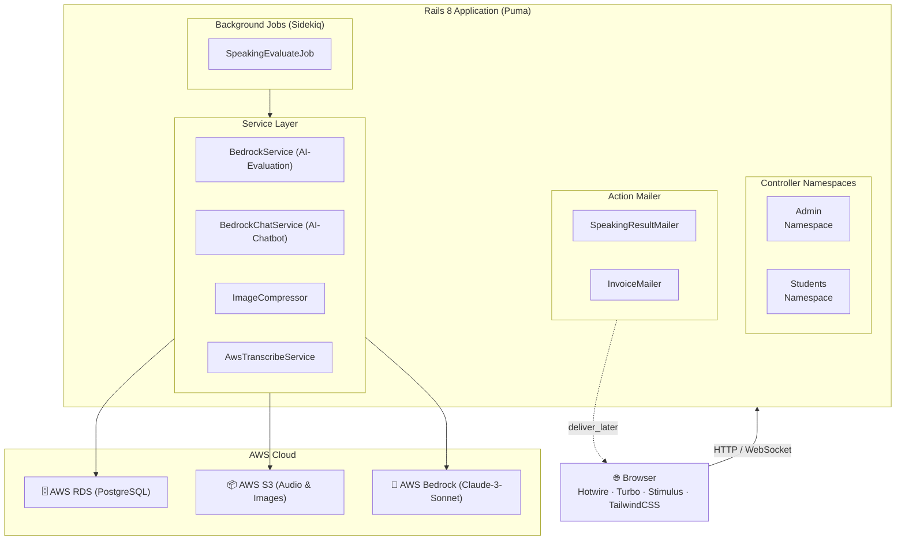
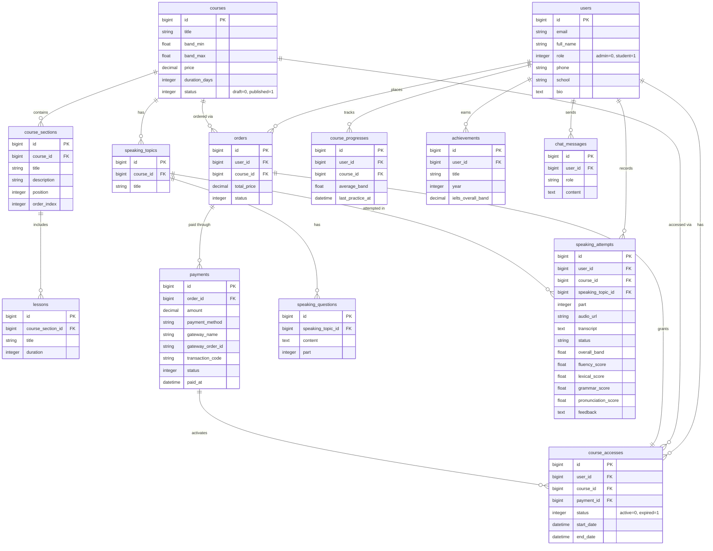
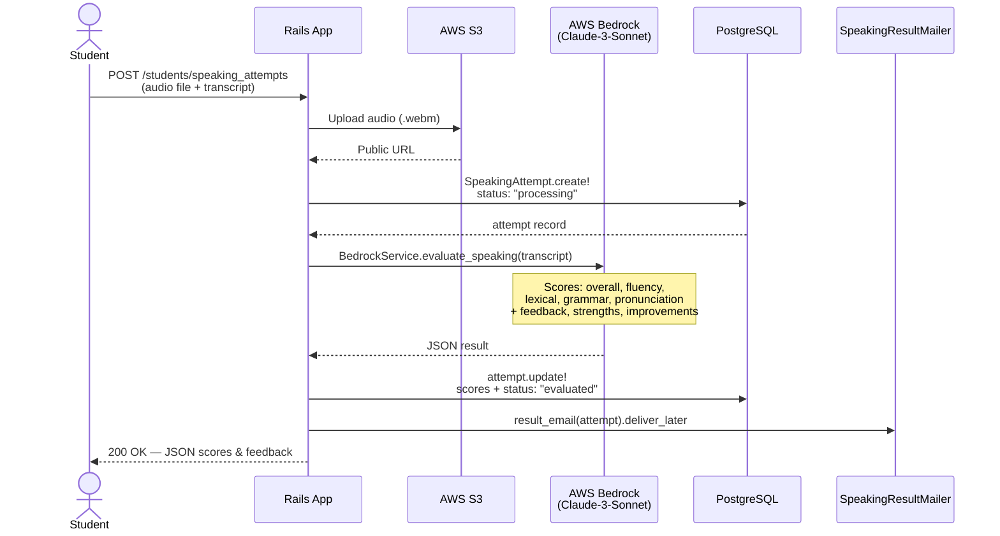
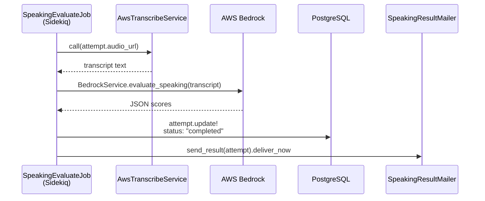
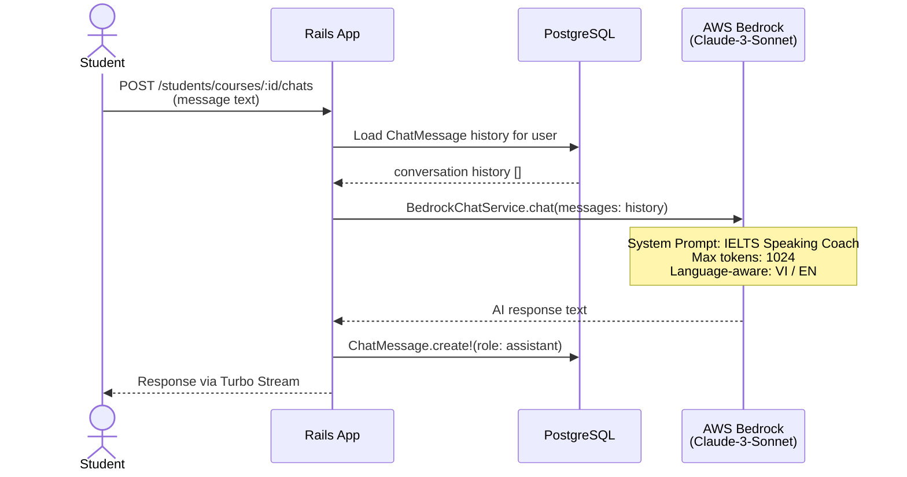
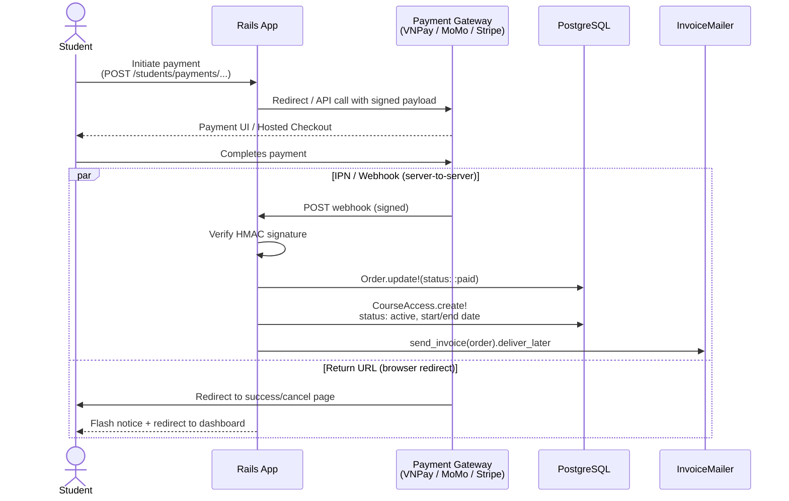
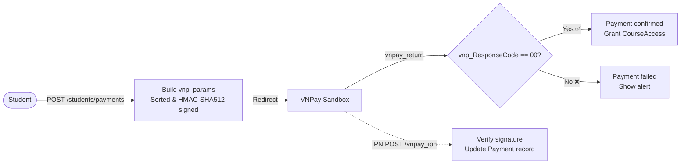
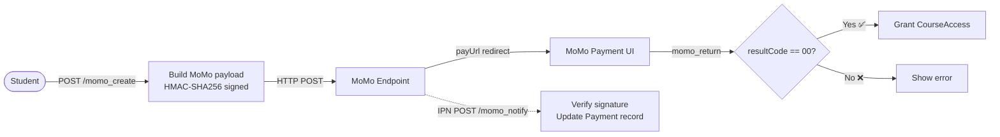
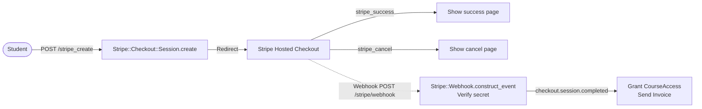

# Technical Architecture

## Overview

IELTS Learning Platform follows the standard **Model-View-Controller (MVC)** pattern of Ruby on Rails 8, extended with Service Objects and Background Jobs for AI processing. The system is designed around two user roles — Admin, Student — each with its own namespaced controller scope.

---

## System Architecture Diagram



---

## Database Schema

### Core Entities

```
users
├── id, email, full_name, role (enum: admin=0, student=1)
├── phone, school, bio, feedback
└── thumbnail (ActiveStorage)

courses
├── id, title, description (ActionText)
├── band_min, band_max, price, duration_days
├── status (enum: draft=0, published=1)
└── thumbnail (ActiveStorage)

course_sections
├── id, course_id, title, description
└── position, order_index

lessons
├── id, course_section_id, title, duration
└── (content via ActionText)
```

### Enrollment & Access Flow

```
orders
├── id, user_id, course_id
├── total_price
└── status (enum: pending=0, paid=1, ...)

payments
├── id, order_id, amount
├── payment_method, gateway_name
├── gateway_order_id, gateway_request_id
├── transaction_code, status
└── paid_at

course_accesses
├── id, user_id, course_id, payment_id
├── status (enum: active=0, expired=1)
└── start_date, end_date
```

### Speaking Practice

```
speaking_topics
└── id, course_id, title, ...

speaking_questions
└── id, speaking_topic_id, content, part

speaking_attempts
├── id, user_id, course_id, speaking_topic_id
├── part, audio_url, transcript
├── status (processing → evaluated | failed)
├── overall_band, fluency_score, lexical_score
├── grammar_score, pronunciation_score
├── feedback, strengths[], improvements[]
└── sample_correction
```

### Progress & Gamification

```
course_progresses
├── id, user_id, course_id
├── average_band
└── last_practice_at

achievements
├── id, user_id, title, description
├── year
└── ielts_overall_band

chat_messages
└── id, user_id, role, content, created_at
```

### Entity Relationships (ERD)



---

## AI Speaking Evaluation Pipeline

The speaking evaluation flow is the core feature of the platform:



**Async variant** via `SpeakingEvaluateJob` (Sidekiq):



---

## AI Chatbot Architecture



---

## Payment Gateway Integration

The platform supports three payment gateways, all handled in `Students::PaymentsController`:

### VNPay
- Creates a signed redirect URL using HMAC-SHA512
- Student is redirected to VNPay sandbox
- Return URL and IPN webhook update payment status

### MoMo
- HTTP POST to MoMo endpoint with HMAC-SHA256 signature
- Handles both IPN (server-to-server) and return URL callbacks

### Stripe
- Uses `Stripe::Checkout::Session` for hosted payment
- Webhook at `/stripe/webhook` processes `checkout.session.completed` events
- Grants `CourseAccess` on successful payment

**Payment → Access Grant Flow:**



#### VNPay Specific Flow



#### MoMo Specific Flow



#### Stripe Specific Flow



---

## File Storage

All file uploads use **Active Storage** backed by **AWS S3** in production.

| Asset | Model | Notes |
|---|---|---|
| User avatar | `User#thumbnail` | Auto-compressed to JPEG via `ImageCompressor` (MiniMagick) |
| Course thumbnail | `Course#thumbnail` | Stored as-is |
| Speaking audio | `SpeakingAttempt` | Uploaded directly to S3 via SDK (not Active Storage) |

---

## Background Job Infrastructure

The project uses **Sidekiq** in the Gemfile for Redis-backed processing.

| Job | Queue | Trigger |
|---|---|---|
| `SpeakingEvaluateJob` | default | After speaking attempt creation (async path) |
| `ActionMailer deliver_later` | mailers | All email notifications |

---

## Deployment

The platform is containerized with Docker and deployed via **GITHUB ACTION** (Basecamp's deployment tool).

```
Dockerfile          ← Production image
Dockerfile.dev      ← Development image with hot-reload
.kamal/             ← Kamal deployment hooks and secrets
```

Kamal hooks support pre/post deploy scripts for zero-downtime deploys.

---

## Security Considerations

- **Authentication:** Devise with email confirmation required (`confirmable`)
- **Authorization:** Role-based via `before_action` checks in each namespace's `base_controller.rb`
- **CSRF:** Standard Rails CSRF protection
- **Webhook Verification:** Each gateway's signature verified before processing
- **File Uploads:** Content-type validation enforced on user thumbnails (PNG/JPG/JPEG/WEBP only)
- **Password Security:** bcrypt via Devise
